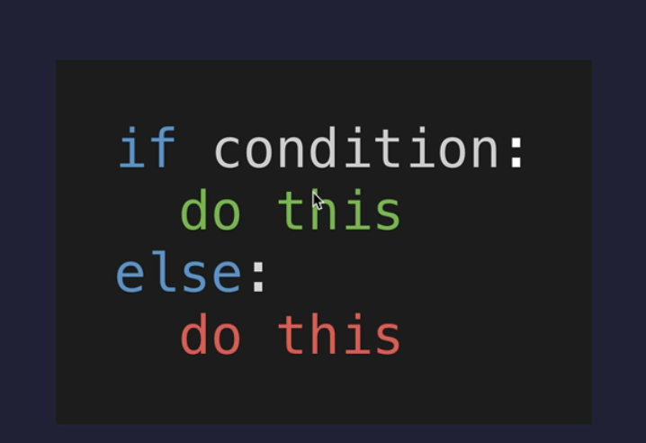
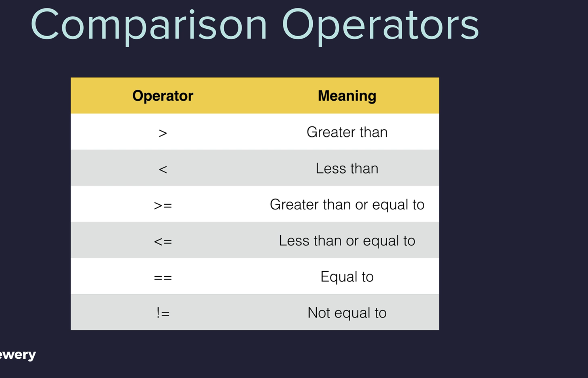

## Python Conditionals and Operators


## Condition Check

Learn to use conditionals in Python to check a conditions and tell the computer what to do in each case.

e.g. 
```python
if <this condition is true>:
    <then execute this line of code>
```
What if the condition is false? The else keyword is used to define a block of code that will execute if the condition checked in the if statement is false.
```python
if pigs can fly:
    <Some code that will never execute>
else:
    print("This is real life")
```
## Python Indentation

Understand the importance of indentation in Python as a way to make certain lines of code subsidaries of other lines of code.

e.g.
```python
if 5 > 2:
    #This is a parent line of code
    print("yes")
    #this is a child line of code
```
## Comparator Operators

| Operator | Description              |
|----------|--------------------------|
| <        | Less than                |
|     >   | Greater than             |
| <=       | Less than or equal to    |
| >=       | Greater than or equal to |
| ==       | Equal to                 |
| !=       | Not equal to             |


